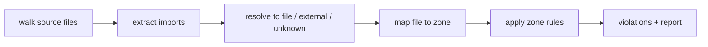
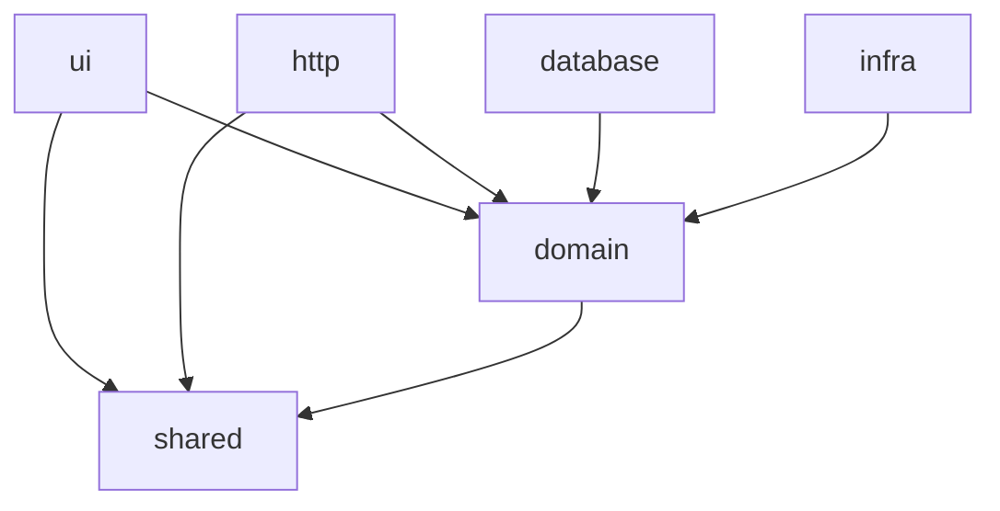

# Fence

[](https://github.com/kujolang/fence)
[](LICENSE)
[](https://github.com/kujolang/kujo)

**Fence prevents architecture-boundary crossings in code.**

A local-first, deterministic architecture-boundary enforcer for Git repositories —
written entirely in the [Kujo](https://github.com/kujolang/kujo/) programming language.

---

## Table of contents

- [Why Fence](#why-fence)
- [What it does](#what-it-does)
- [Quick start](#quick-start)
- [Commands](#commands)
- [Documentation](#documentation)
- [Example output](#example-output)
- [How it works](#how-it-works)
- [Exit codes](#exit-codes)
- [Limitations](#limitations)
- [Project layout](#project-layout)
- [Contributing](#contributing)

## Why Fence

AI agents are very good at making code *work* — and very good at quietly
violating architecture in the process: UI code that talks straight to the
database, domain logic that imports framework code, hidden coupling that becomes
expensive later. There is usually no deterministic guardrail to stop it.

Fence is that guardrail. It encodes your architecture as a repo-local contract
(`fence.toml`) and reports when an import crosses a forbidden boundary. When
you wire the check into CI, it can fail the build. It is deterministic (no LLM,
no network — the same repository state always yields the same report), so it is
safe to gate CI and to hand to autonomous agents as an architectural constraint.

> **For engineering leaders:** architecture drift is a slow, compounding cost.
> Reviews catch some of it; nothing catches all of it consistently. Fence turns
> your intended boundaries into an executable contract that runs on every change,
> scoped to the diff in CI, with machine-readable output (JSON/SARIF) for your
> existing tooling. It is dependency-light, offline, and — scoped to a diff with
> `--changed-only` — fast enough to gate every pull request.

## What it does

Fence reads `fence.toml` (architecture **zones** with `paths` /
`can_depend_on` / `cannot_depend_on` / `severity`), scans your source files,
extracts their imports, maps each file to a zone, and reports every dependency
that crosses a boundary the contract forbids — with a deterministic fix
suggestion for each.

Supported scan languages (best-effort, line-based import detection): Kujo,
JavaScript/TypeScript, Python, Rust, PHP, Go. **Fence itself is 100% Kujo.**

## Quick start

```bash
kujo run fence.kujo -- init                 # create a starter fence.toml
kujo run fence.kujo -- check                # scan and report violations
kujo run fence.kujo -- explain src/ui/LoginForm.tsx
kujo run fence.kujo -- graph --format mermaid --output architecture.mmd
```

Expected first-run signals:

```text
Created fence.toml (template: layered).
Next: edit fence.toml, then run `kujo run fence.kujo -- check`.
```

When the generated config matches a clean repo, `check` reports `Status: PASSED`.

Module resolution is relative to `fence.kujo`; file scanning happens in your
current directory — so you can run the tool from anywhere inside a target repo:

```bash
kujo run /path/to/fence/fence.kujo -- check
./fence.sh check        # equivalent convenience wrapper
```

## Commands

| Command | Purpose |
| --- | --- |
| `init` | Create a starter `fence.toml` (`--template`, `--force`) |
| `check` | Scan source files and report boundary violations |
| `explain <path>` | Show how Fence classifies one file and each of its imports |
| `graph` | Print the architecture dependency graph (human/json/dot/mermaid, `--cycles`) |
| `baseline create` | Record current violations so legacy repos can adopt Fence gradually |
| `validate` | Validate `fence.toml` (incl. overlap & cycle warnings) |
| `doctor` | Print environment diagnostics |
| `help` / `--help` | Usage text |
| `version` / `--version` | Version text |

Templates: `layered` (default), `cli`, `web-app`, `hexagonal`, `mvc`,
`feature-sliced`.

## Documentation

| Page | Contents |
| --- | --- |
| [Getting started](docs/getting-started.md) | Install, first run, the agent workflow |
| [Configuration](docs/configuration.md) | `fence.toml` reference, zones, severities, external deps |
| [Commands](docs/commands.md) | Every command and flag with examples |
| [CI integration](docs/ci.md) | Gating builds, changed-only, baselines, SARIF |
| [JSON schema](docs/JSON_SCHEMA.md) | Stable machine-readable output contract |
| [Architecture](docs/architecture.md) | Module map and how the pipeline works |
| [Performance](docs/performance.md) | Measured numbers and scaling guidance |
| [FAQ](docs/faq.md) · [Troubleshooting](docs/troubleshooting.md) | Common questions and fixes |
| [Completed v1 checklist](docs/ENHANCEMENTS.md) | Prior hardening work already completed |
| [Next enhancements](docs/NEXT_ENHANCEMENTS_2026-06-19.md) | Next-session roadmap |

## Example output

```text
Fence Report
============

Status: FAILED
Files scanned: 84
Imports checked: 213
Violations: 2
Errors: 2
Warnings: 0

Violations
----------
[ERROR] ui -> database is not allowed
  File: src/ui/LoginForm.tsx
  Import: ../database/users
  Resolved: src/database/users.ts
  Rule: zones.ui.cannot_depend_on includes database
  Suggestion: Move database access behind a domain or service boundary.
```

Machine-readable output is available via `--format json`, `--format sarif`, and a
PR-ready `--format markdown` (with an **AI / Human Handoff** section).

## How it works



Allowed dependency direction (default `layered` template):



## Exit codes

`0` success · `1` violations at/above `fail_on` · `2` invalid usage/config ·
`3` parse error · `4` runtime · `5` IO · `6` internal.

## Limitations

Best-effort line-based import detection (no AST); pragmatic glob matching
(`**`, `*`, `?` — no `{}`/`[]`); conservative output-path safety (textual checks
plus `.git`, parent-traversal, absolute-path, and symlink-escape guards). See
[docs/troubleshooting.md](docs/troubleshooting.md) and
[docs/architecture.md](docs/architecture.md) for the full detail.

## Project layout

```
fence.kujo              entry point (args -> dispatch -> exit code)
src/*.kujo              implementation modules (see docs/architecture.md)
tests/fence_tests.kujo  run-mode test harness (123 assertions)
docs/                   documentation
agent/                  ignored archive of implementation prompts and handoffs
```

## Contributing

See [CONTRIBUTING.md](CONTRIBUTING.md) for the module map, the Kujo VM quirks to
respect, and how to add a language extractor or run the tests. Security policy:
[SECURITY.md](SECURITY.md). Changes: [CHANGELOG.md](CHANGELOG.md).

Licensed under [MIT](LICENSE).
