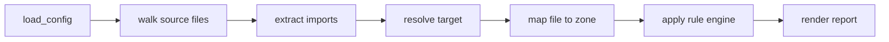

# Architecture

Fence is implemented entirely in Kujo: an entry point (`fence.kujo`) plus 31
focused modules under `src/`. Functions are kept small and call chains shallow
because the Kujo VM has a limited call stack.

## Pipeline

1. **load_config** (`config.kujo`) parses `fence.toml` and normalizes defaults.
2. **walk** (`walk.kujo`) traverses `source_roots`, applying include/exclude
   globs, via an explicit stack (no recursion).
3. **extract imports** (`imports.kujo`, `imports_ext.kujo`) scans each file
   line-by-line for import statements and records one-based source lines.
4. **resolve** (`resolve.kujo`) maps a raw import to an internal file, an
   external package, or unknown.
5. **map zone** (`zones.kujo`) finds the first zone whose `paths` match.
6. **rule engine** (`rules.kujo`) decides allowed/denied and builds violations.
7. **render** (`reports.kujo`, `graph.kujo`) produces human/JSON/markdown/SARIF.

The orchestration lives in `analyze.kujo` (`analyze_files`), driven by the
command modules. Analysis maintains per-run import-resolution and zone-match
caches; both are discarded at process exit and cannot affect deterministic
output.

`graph --observed` reuses the pipeline to compare configured allowed edges with
cross-zone internal edges actually found. Same-zone edges are omitted.

## Module map

| Module | Responsibility |
| --- | --- |
| `fence.kujo` | Entry point: `args()` → `cli_dispatch` → `exit(code)`. |
| `cli.kujo` | Command dispatch. |
| `cliargs.kujo` | Parse `command`, positionals, and `--flags`. |
| `meta.kujo` | Version string and help text. |
| **Commands** | |
| `cmd_init.kujo` | `init` |
| `cmd_check.kujo` | `check` (walk → analyze → render → output → exit) |
| `cmd_explain.kujo` | `explain <path>` |
| `cmd_graph.kujo` | `graph` (+ `--cycles`) |
| `cmd_baseline.kujo` | `baseline create` |
| `cmd_validate.kujo` | `validate` |
| `cmd_doctor.kujo` | `doctor` |
| `cmd_workspace.kujo` | `workspace init` manifest discovery. |
| **Config** | |
| `config.kujo` | Load + normalize `fence.toml` / `fence.json`. |
| `validate.kujo` | Structural validation, overlap + cycle warnings. |
| `templates.kujo` | Starter config templates. |
| **Analysis** | |
| `walk.kujo` | Iterative file traversal + include/exclude filtering. |
| `glob.kujo` | Pragmatic glob matcher (`**`, `*`, `?`). |
| `imports.kujo` | Import extraction: Kujo, JS/TS, Python. |
| `imports_ext.kujo` | Import extraction: Rust, PHP, Go. |
| `resolve.kujo` | Import resolution (internal/external/unknown). |
| `zones.kujo` | File → zone mapping. |
| `rules.kujo` | Dependency rule engine + external rules + suggestions. |
| `ignores.kujo` | Reasoned, expiring structured exceptions. |
| `cycles.kujo` | Dependency-cycle detection (Kahn's algorithm). |
| `analyze.kujo` | The walk→…→violations orchestration. |
| **Output** | |
| `reports.kujo` | human / JSON / markdown / SARIF renderers + summary. |
| `graph.kujo` | Architecture graph renderers (human/json/dot/mermaid). |
| `baseline.kujo` | Baseline fingerprints, load/apply. |
| `output.kujo` | Path-safe file writing. |
| **Foundations** | |
| `paths.kujo` | Path safety + manipulation helpers. |
| `git.kujo` | Safe Git integration (changed-only, diagnostics). |
| `util.kujo` | Shared helpers (sort, join, predicates). |

## Adding a language extractor

1. Add `extract_<lang>(content)` returning records
   `{ kind, path, raw, line }` (see existing extractors in `imports.kujo` /
   `imports_ext.kujo`). Scan line-by-line; keep it best-effort.
2. Register the file extension(s) in `extract_for_ext` (`imports.kujo`).
3. If the import syntax needs new resolution behavior, extend
   `module_to_path` / `resolve_import` in `resolve.kujo`.
4. Add include globs for the extension to the templates in `templates.kujo`.
5. Add assertions to `tests/fence_tests.kujo` and run
   `kujo run tests/fence_tests.kujo`.

## Result-object conventions

Fence functions that can fail return a dictionary rather than throwing, so
callers branch explicitly. Two shapes are used consistently:

- **Operation result** — `{ "ok": bool, "error": string, ... }`. Used by
  `output.write_safe`, `reports`/`graph` render helpers (`text` payload), and
  similar. On failure, `ok` is `false` and `error` is a human-readable message.
- **Command/IO result with an exit code** — `{ "ok": bool, "error": string,
  "code": int, ... }`. Used where the failure maps to a process exit code
  (`git.changed_files` → `code`, the `check` file-selection helper, etc.). The
  command layer returns that `code` from `cli_dispatch`.

Config loading uses a richer variant: `{ found, ok, error, path, config }` so
callers can distinguish "no config" (`found = false`, exit 2) from "bad config"
(`ok = false`, exit 3). Predicate helpers live in `util.kujo`
(`dict_has`, `truthy`, `arr_has`) and should be used instead of comparing
`has_key(...)`/`contains(...)` to `true`, because those builtins return `1`.

The single source of truth for the version string is `meta.fence_version()`.

## Kujo VM constraints (must respect)

These are runtime/compiler realities that shaped the code; ignore them and you
will hit crashes or `kujo check` failures:

- **One `for` per function** and **no duplicate `let` names** across `if`
  branches in a function — use `while` loops with unique names.
- **Imports must be `from src.x import name`**; qualified `src.x.f()` is not
  supported. Exports require `export func`.
- **`ProcessResult` fields use dot access** (`r.success`, `r.stdout`).
- **`has_key(...)` and string `contains(...)` return `1`, not `true`** — use
  `dict_has` / `truthy` (in `util.kujo`).
- **Multi-line string literals need `\n`** (no literal newlines); `\"` escapes a
  quote.
- **`pop(a)` returns `[new_array, element]`** and does not mutate in place.
- **Tree walks are iterative** (explicit stack) to avoid recursion-in-loop state
  corruption.
- **Shallow call stack (~6 user frames):** keep call chains flat; prefer
  top-level helpers over deep nesting.

See `agent/DECISIONS.md` (D4) for the verified details behind each item.
